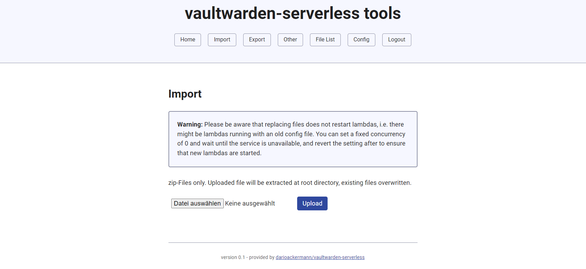

Welcome to vaultwarden-serverless, providing you with the power to host your favorite password manager on serverless AWS infrastructure, at almost no cost!

---

  


vaultwarden-serverless is based on [vaultwarden](https://github.com/dani-garcia/vaultwarden)

---

# Table of contents

- [Table of contents](#table-of-contents)
- [Known issues 🐛](#known-issues-)
- [Install / Build 💿](#install--build-)
  - [From releases 📁](#from-releases-)
  - [Build it yourself 💻](#build-it-yourself-)
- [Deployment (with Terraform) ☁️](#deployment-with-terraform-)
  - [Notes 🗒️](#notes-)
  - [Config values ⚙️](#config-values-)
  - [Deployed functionality 📱](#deployed-functionality-)
  - [Change DB backend 🗄️](#change-db-backend-)
- [Manual Deployment 👷](#manual-deployment-)
- [Tools 🛠️](#tools-)
- [Contributing 🐱‍👤](#contributing-)
- [Sponsoring ❤️](#sponsoring-)


## Known issues 🐛

- **Integration with SQLite can fail you at random times**: Due to concurrency, in unlucky events, multiple parallel actions (e.g. logins, registrations) etc. might lead to a database lockup preventing you temporairily from logging in /
using your vaultwarden. So far, **no corrupted db's have been observed**, however you'll be locked out until lambda instances get replaced. Please see https://github.com/darioackermann/vaultwarden-serverless/pull/1#issuecomment-1732654356 and https://github.com/darioackermann/vaultwarden-serverless/issues/2#issue-1909470641

## Install / Build 💿

### From releases 📁
You can download the prebuilt, ready-to-deploy zip file from releases.

### Build it yourself 💻
 
To build the bootstrap file yourself, you need `docker`.   
Also, around 6GB of RAM is recommended to be able to build succesfully.

```sh
# Go to build directory
cd build
# Clone vaultwarden
git clone -b add-serverless-support https://github.com/darioackermann/vaultwarden-serverless.git
# Build lambda-builder
docker build . -t lambda-builder
# Build lambda-bootstrap binary
docker run --rm --mount type=bind,source="./vaultwarden-serverless/",target=/build lambda-builder
```

You will find a `bootstrap.zip` in your build folder that you can now deploy using terraform.

## Deployment (with Terraform) ☁️

A toy example involving a complete setup with terraform is provided in `examples/`.
Deploy it using `terraform init`, `terraform apply`

### Notes 🗒️

**Note 1:** **To save 99% costs**, this deployment violates AWS best practises as it does neither use a NAT-Gateway nor an ALB/ELB. We assign an elastic IP to the lambda
network interface which allows us to reach the internet regardless of a missing gateway.

**Note 2:** During deployment, Terraform will wait to verify DNS entries for the Certificate.
Please look up the needed values in your console and set them accordingly.

**Note 3:** If you want to import old config, sqlite databases, DO NOT browse the vault after deployment but rather go to the tools page to import your old config - otherwise you will already spin up a lambda with newly generated config files (which you then need to wait for to go down again). After importing old private/public keys, you might need to authenticate again on the tools website (if you hit a new lambda with your restored config)


### Config values ⚙️

Create an appropriate `terraform.tfvars` with desired values of

```
vaultwarden_admin_hash = "VALID ARGON2 HASH"
gateway_domain         = "vaultwarden.yourserver.com"
aws_region             = "eu-central-1"
```

### Deployed functionality 📱

* Vaultwarden using SqLite as database
* Small VPC with one public subnet, a route-table and an internet gateway
* API Gateway including Certificates (**setting of DNS entries for certificate verification manually required**)
* EFS with backup (default settings) enabled

Your setup will be reachable on the following domains:
* Vault: https://vaultwarden.yourserver.com
* vaultwarden-admin: https://vaultwarden.yourserver.com/admin 
* vaultwarden-serverless-tools: https://vaultwarden.yourserver.com/tools

### Change DB backend 🗄️

Despite breaking "serverlessness", of course you can also use mysql or postgresql. To do so, you can proceed as you would do in a normal vaultwarden setup. 
* Specify `DATABASE_URL` with the appropriate connection string to the environment of the Lambda function (see https://github.com/dani-garcia/vaultwarden/blob/main/.env.template#L18)
* Modify security groups to allow egress of `tcp/3306` (mysql) or `tcp/5432` (postgres)

## Manual Deployment 👷

Of course you can also just take the provided bootstrap and build a different ecosystem around it. You can always use the provided terraform example as a start. 
When deploying a lambda with the bootstrap, remember to choose `Amazon Linux 2 (own bootstrap)`. 
The handler can be set arbitrarily - it has no effect.

And if you build something awesome, I'll happily include your example in this repo. Just open a PR! 🚀

## Tools 🛠️
Included in this repo is "vaultwarden-serverless-tools", a little toolset that allows you to import and export the db and other data with ease. Also, it allows other small changes


## Contributing 🐱‍👤

Your contribution is gladly appreciated. Please feel free to open issues and pull requests, and I'll have a look at them as soon as possible. To easen my work, please provide as much information as possible (for bugs) and as much description as possible (for pull requests)

##  Sponsoring ❤️

I'm a student maintaining this project in my freetime. If it helps you keeping your monthly costs down, I'd appreciate a one-time tip or monthly support to keep my free work going. Thanks a lot ❤️  
[](https://github.com/sponsors/darioackermann)
